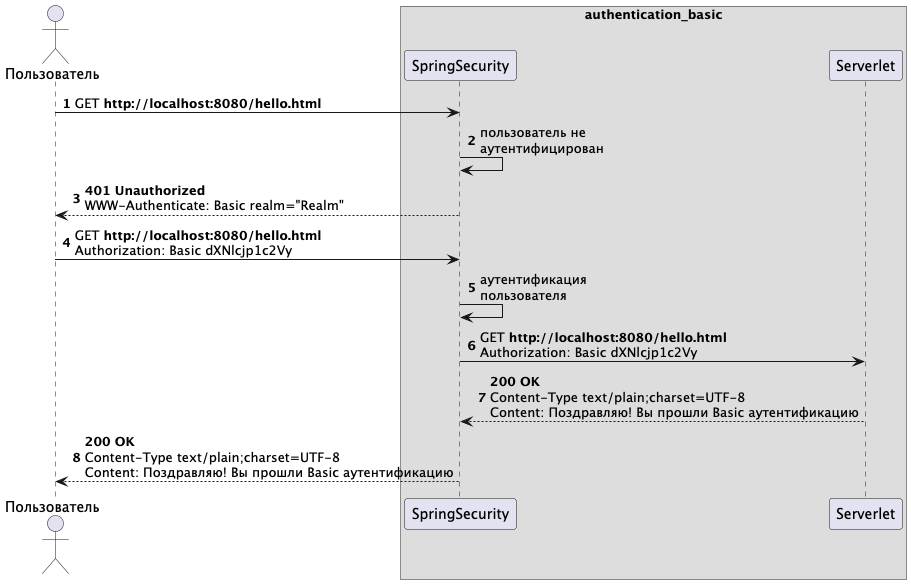

# 🔐 HTTP Basic Authentication – Spring Security

Микросервис реализует схему аутентификации HTTP Basic с использованием Spring Security.

Разработка выполнена в рамках выпускной квалификационной работы:

> **Анализ современных методов аутентификации: устойчивость к угрозам информационной безопасности и перспективы развития беспарольных технологий**  
> НИУ ВШЭ, направление "Информационная безопасность", Федосов М.И., 2025

---

## 📌 Описание

HTTP Basic — один из простейших и наиболее распространённых методов аутентификации в протоколе HTTP. Несмотря на простоту реализации, он уязвим без использования HTTPS и не защищён от атак перебора и перехвата учетных данных.



Микросервис:

- Разработан с использованием Spring Boot 3 и Spring Security.
- Предоставляет защищённую конечную точку `/hello`.
- Требует basic-аутентификацию (логин/пароль) для доступа к API.

---

## 🧩 Технологии

- Java 21
- Spring Boot 3
- Spring Security
- Maven

---

## ⚙️ Запуск проекта

```bash
git clone https://github.com/m-fedosov/authentication_basic.git
cd authentication_basic
./mvnw spring-boot:run
```

